# Designrunden 08.10.2026 — rapport

Oppdraget var å løfte hele nettstedet fra «riktig, men ser billig ut» til
et nivå der designarbeidet kan legges bort lenge, innenfor sju grenser:
ingen nye tall eller påstander, forbehold slettes aldri, rå
registerverdier står uendret, ingen eksterne ressurser og hel uten
JavaScript, ingen adresser endres, bare lys modus, og ingen omtale av
rapporter eller tjenester.

Grenen er `claude/charming-mayer-arhkot`, én commit per komponent eller
side. Datarepoet er ikke rørt.

Bildene ligger i `for/` og `etter/` ved siden av denne fila, i 390 og
1440 px. En side som er lavere enn tre skjermhøyder er tatt hel; en
høyere side er tatt som øverste skjermhøyde pluss ett utsnitt per
seksjon (hver synlige H2 i innholdet, og bunnteksten). Begge settene er
tatt av fulle bygg mot det samme datasnapshotet (datarepoet
`e244429`), med `deviceScaleFactor 1`. Parene står nederst.

## Kort

- **Toppen er lys, papiret er lysere.** Det mørke båndet over hvert
  sidehode er borte; mørk flate står bare i herofotografiet og
  bunnteksten. Papiret gikk fra `#e7dbd0` til `#f4eee6`, og all tekst
  står sterkere mot det.
- **Én typeskala med sju trinn**, ett avstandsrutenett, én venstrekant.
- **Navn i menneskelig form**: «Mowi Seawater Norway AS», «Herøy, Møre
  og Romsdal». De rå versalene står uendret der de siteres og lastes ned.
- **Hver side følger briefens tabell «Sider og jobb»**: det siden svarer
  på står øverst, metode og forbehold lenger ned eller bak et klikk.
- **Sidene er kortere**, mest på telefon: ukesiden 28 077 → 10 873 px,
  områdesiden 59 939 → 17 323 px på 390.
- **Kart og grafer** har et verktøytips som står inne i figuren og aldri
  over bildeteksten, og tastaturet når alt pekeren når.
- **Stilguiden er skrevet om** (`docs/design/STILGUIDE.md`) og
  stilarket er ryddet for det ingen bruker.

## Hva som er endret, og hvorfor

### Grunnlaget, alle sider (`f121604`)

| Før | Nå | Hvorfor |
|---|---|---|
| Mørkt bånd over sidehodet | Menylinje på papir med hårlinje under | Båndet veide mer enn innholdet og gjorde hver side til to |
| Papir `#e7dbd0` | `#f4eee6` | Den gamle flata spiste kontrasten; tabellene så ut som kartong. Dempet tekst 4,63 → 5,46:1, rust 4,54 → 5,36:1 |
| 16 skriftstørrelser, flere 0,5 px fra hverandre | 7 trinn | To størrelser så tett leses som en feil, ikke et hierarki |
| Rust lenke med strek på hvert navn | Rust i løpende tekst; blekk med svak strek i tabeller og lister | En tabell med 80 navn var 80 oransje streker |
| Omrissknapper for følg, siter, last ned | Verktøylinje med lenker, ↓ foran nedlastinger | Det er lenker, og omrissknappene så ut som en mal |
| Tre former for «vis mer» | Én: hårlinje og en strek-pil som vris | Samme ting skal se likt ut |
| Tabelltittel med strek i kanten, tittel etter tabellen noen steder | Tittel over, note under, tone på raden under peker | Leserekkefølge; tonen erstatter en radstripe som aldri virket |
| Tabellrad som kort med etiketten over verdien | Etiketten til venstre | Halverte høyden på hvert kort |

### Registernavn (`703d040`)

`visningsord.selskapsnavn()` og `kommunenavn()`. Organisasjonsformen
står i versaler (AS, ASA, NUF, ENK …) — det er ikke pynt: portens
personformprøve leser dem slik. Initialord uten vokal står i versaler,
og en målt liste med initialord som har vokal (OFS, AFC …). Målt mot
alle 2 139 navn i eierskap og enhetsregisteret. Rå verdi står uendret i
registerfeltene, siteringen, JSON-LD og nedlastingene.

### Forsiden (`1ad784d`)

Briefen: én setning om hva vi er, ukas viktigste endringer og søk
øverst; arkivtall, kart og følg med under.

- Heroen er lavere (56svh, høyst 560 px; var 70svh/760), og
  taglinjen — setningen om hva Kystloggen er — er 16–20 px, var 13.
- «Denne uka» viser ukas ingress, de tre faktasetningene fra ukesiden og
  de fem største endringstypene som stolper med lenke til typesidene.
  Tallene er brikkenes på ukesiden; ingen rangering er lagt til.
- Arkivtallene står rett under uka.
- Kysten står på papir. Trafikklyset er data, og data står på papir.

### Ukesiden (`f4c712c`)

Under 640 px er en endringsrad et kort på tre linjer: navnet, endringen,
og dato · kommune · område · type. Seks linjer med etikett per rad gjorde
uke 41 28 077 px høy på 390. «Last ned uka» er en verktøylinje.

### Lokalitetssiden (`53884fd`)

- Alt innhold i venstrespalta, tilstand og kart i en smal høyrespalte
  som følger med. Til nå sluttet venstrespalta etter tidslinja, og når
  den var kort, sto kartet alene med et tomrom ved siden av.
- Siteringen står sist. Den sto mellom fisk til stede og lusegrafen.
- **«0 stykk» per tillatelse er forklart.** Når registeret oppgir 0, sier
  en note under tabellen at 0 er registerets egen verdi, viser
  lokalitetens klarerte kapasitet som alt står i tilstanden, og
  gjentar setningen fra områdesidene om at de to er ulike størrelser.
  Den sier ikke hvorfor — det oppgir ikke registeret.

### Selskapssiden (`0993562`, `43c1b08`)

De nyeste vesentlige endringene står åpent; resten i sin egen tabell bak
«Vis resten av de 83 vesentlige endringene». Til nå sto alle bak ett
klikk, og siden svarte ikke på «hva har endret seg». Forbeholdet om hva
tallene gjelder står rett under nøkkeltallene, og «Hva denne siden ikke
sier» bak et klikk. Mowi Seawater Norway AS: 4 061 px på 390 (briefen:
under 5 000).

### Områdesiden (`6753822`)

Sidehodet viser fargen som gjelder nå og fargen i hver runde som en
stripe, med en lenke ned til «Kildene for fargen». Der står alt som før
sto i sidehodet: rundekortene, hva fargen betød i hver runde,
fyllnøkkelen, departementets egne ord og «Hvor sterkt fargen er belagt».
Ingenting er strøket. Beholdningsgrafen kommer nå før en skjermhøyde.
Områdekartet har tak på høyden.

### Indeksene og søk (`e0b9140`, `d21fa5f`)

Tittel, tall og søkefelt i sidehodet; til nå sto søkefeltet over
tittelen, og siden begynte med et skjema uten å si hva den var.
Forklaringene står som noter. På søkesiden er veiviseren uten skript en
seksjon som de andre.

### Om (`d21fa5f`)

«Hvem som står bak» er flyttet opp rett etter «Hva dette er», som
briefen ber om. Tabellene har hele spalta; lisenstabellen med ordrett
attribusjon ble kuttet på 1440. Innholdslista og søkesidens innhold lå
56 px innenfor tittelen; en regel i stilarket holder nå venstrekanten
lik overalt.

### Tabellkort og trafikklys (`07a1906`)

To feil som fantes fra før, funnet underveis:

- En etikett på to linjer i et tabellkort la seg over neste rad.
- Trafikklysruta og kortetiketten delte samme pseudoelement, og på 390
  ble etiketten «Farge» tegnet som en farget stolpe. I vedtakstabellen
  på områdesiden sto fra- og til-fargene med tomme ruter, og
  Felt-cella med en rute den ikke skulle ha — det så ut som
  avkrysningsbokser.

### Kart og grafer (`f3201f0`)

- Pekeren treffer punktene: bakgrunnslagene tar ikke imot peker
  (`f121604`).
- **Verktøytipset** tegnes inne i figuren, snur ved kanten av
  tegneflata og dekker aldri bildeteksten. Det vises også ved fokus.
- **Grafene** er ett tabulatorstopp; piltastene, Home og End går gjennom
  søylene, og verdien leses av en skjult statuslinje.
- Uten skript viser nettleseren `<title>` som før, og hver verdi står i
  tabellen under figuren.

### Rydding og stilguide (`44b4ad2`, `91a97e6`, `89d7a81`)

`.mork` og de 17 reglene under den, åtte tokens uten bruk og tre klasser
som bare bar en fjernet stil er borte. Luften under sidehodet er den
samme på telefon som på bred skjerm. `STILGUIDE.md` er den gjeldende
stilguiden: prinsipper, tokens, komponenter, når og hvorfor, og det som
bevisst ikke brukes.

## Høyder før og etter

Målt av skjermbildeskriptet på de samme sidene, i piksler.

| Side | 390 før | 390 etter | 1440 før | 1440 etter |
|---|---:|---:|---:|---:|
| Forsiden | 7 673 | 6 617 | 3 764 | 3 297 |
| Uke 41 | 28 077 | 10 873 | 5 987 | 5 376 |
| Lokalitet 45140 | 8 918 | 7 337 | 4 769 | 4 143 |
| Lokalitet 12325 | 5 747 | 5 016 | 3 674 | 3 073 |
| Selskap 921668236 | 4 284 | 4 061 | 3 427 | 2 909 |
| Område 4 | 59 939 | 17 323 | 15 160 | 12 806 |
| Lokalitetsindeksen | 6 974 | 6 475 | 6 598 | 5 526 |
| Om | 12 448 | 9 777 | 6 214 | 5 445 |

## Valg du bør vite om

1. **OWID og SSB er ikke sett.** Begge vertene svarte 403 fra proxyen i
   denne økta. Reglene i `REFERANSER.md` er skrevet av det jeg vet om
   de to nettstedene, og fila sier det rett ut. Vil du at de skal
   etterprøves, må `ourworldindata.org` og `www.ssb.no` åpnes i
   miljøets nettverksinnstillinger.
2. **«Kapasitet per selskap» på områdesiden er ikke lagt til**, selv om
   briefens tabell nevner det. Det ville vært nye tall — summer over
   lokalitetene — og lokalitetens kapasitet er ikke selskapets. Lista
   viser innehaver og kapasitet per lokalitet, og søkefeltet filtrerer
   på selskap. Skal det inn, trengs en beslutning om hva tallet er.
3. **Papiret er lysere.** Det er den største synlige endringen i
   merkevaren. Hver tekstfarge er målt på nytt mot det.
4. **Kysten på forsiden står på papir**, ikke på mørk flate. Mørkt er
   nå bare fotografiet og bunnteksten.
5. **Navnene vises i menneskelig form.** Regelen er målt mot alle navn
   i dagens data, men et nytt navn med et initialord som har vokal
   (som «OFS») vil vises som «Ofs» til det legges i
   `visningsord.INITIALORD_SELSKAP`. Den rå verdien er uansett uendret.
6. **Lokalitetslista på område- og selskapssiden er ikke kort på
   telefon.** Den er en indeks, og én linje per rad som ruller
   vannrett er lettere å skumme enn 137 kort.
7. **Selskapssiden viser de fem nyeste endringene åpent**
   (`SELSKAP_NYESTE_ENDRINGER`), og forsiden de fem største
   endringstypene (`FORSIDETYPER`). Begge er ett tall i `nettsted.py`.
8. **Nye tekster sier bare det som står fra før.** Det er etiketter
   («Tilstanden nå», «Kildene for fargen», «Etter type», «Last ned uka»)
   og noten om «0», som gjentar registerverdien og en setning fra
   områdesidene. Alle tall i teksten på de 128 sidene
   utviklingsbygget lager er sammenlignet med `origin/main`: det
   eneste nye er «33» på forsiden, i ukas faktasetning, som står
   ordrett på ukesiden.

## Vurdert og latt være

| Hva | Hvorfor ikke |
|---|---|
| Hamburgermeny | Fem punkter får plass; en skjult meny er et klikk til for alle |
| Stolpebredde som inline-stil | CSP-en tillater det, men en SVG-`rect` gjør det samme uten |
| Kort for lokalitetslistene | Se valg 6 |
| Større treffflate på små kartpunkter | Krever endring i kartgeneratoren og i markupkontrakten for kartene |
| Verktøytips på forsidens typestolper | Tallet står ved stolpen; et tips ville gjentatt det |
| Avrundede tall i grafenes tips | Tipset viser `<title>`-teksten generatoren skriver, ordrett. Avrunding er en endring av hva verdien er |
| Mørk modus | Briefen: bare lys |
| Egen side for loggen (`/logg/`) | Briefen beskriver den, men den er en ny sidetype med egen pakke — ikke en designrunde |

## Hva som gjenstår

- Heines eget herofotografi (briefen) erstatter det nåværende.
- Postmalen for loggen, når den bygges.
- Kapasitet per selskap, om du bestemmer hva tallet skal være (valg 2).
- Etterprøving av `REFERANSER.md` mot de to nettstedene (valg 1).
- Grafenes tips viser lusetallene med alle desimalene i dataene
  («0,018181818»). Det er riktig, men tungt å lese; en avrunding i
  visningen bør være en egen beslutning.

## Grensene, punkt for punkt

| Grense | Hvordan den er holdt |
|---|---|
| 1. Ingen nye tall eller påstander | Tallsammenligningen i valg 8. Porten er grønn i hver commit uten nye kvitteringer; ingen kvitteringsfil er endret |
| 2. Forbehold slettes aldri | Flyttet eller lagt bak `
` med en summary som sier hva som står der: «Hva denne siden ikke sier» på selskaps- og områdesiden er bak et klikk med overskriften i summaryen; trafikklysets kilder og belegg er flyttet ned på områdesiden; forbeholdet om hva tallene gjelder er flyttet opp i sidehodet på selskapssiden. Ingen tekst er strøket |
| 3. Rå verdier uendret | Visningen er menneskelig; registerfeltene, siteringen, JSON-LD og nedlastingene har kildens verdi. Prøvene i `test_visningsord.py` og `test_nettsted.py` |
| 4. Ingen eksterne ressurser, hel uten JS | CSP-en i `nettsted.VERTSHODER` er urørt. Ingen rammeverk. Alt skriptet gjør er forbedring, og tastaturet når det pekeren når (`test_smalskjerm.py`) |
| 5. Adresser endres ikke | Samme 128 sider i utviklingsbygget før og etter, og ingen `id` er fjernet fra noen av dem. Nye ankre er bare lagt til |
| 6. Lys modus, fontene, kontrast, fokus | Én palett; Newsreader og IBM Plex; `test_kontrast.py` grønn; `:focus-visible` overalt |
| 7. Ingen rapporter eller tjenester | Ingen slik tekst er lagt til |

## Verifisering

Hver kodecommit er bygget fullt mot datarepoet i en egen worktree,
kjørt gjennom porten med `produksjon=True`, og testet med hele
prøvesettet mot det bygget (`HAVBRUK_NETTSTED`).

| Commit | Port | Prøver |
|---|---|---|
| `f121604` | grønn | 1 678 bestått |
| `703d040` | grønn | 1 682 bestått |
| `1ad784d` | grønn | 1 685 bestått |
| `f4c712c` | grønn | 1 685 bestått |
| `53884fd` | grønn | 1 687 bestått |
| `0993562` | grønn | 1 688 bestått |
| `6753822` | grønn | 1 688 bestått |
| `e0b9140` | grønn | 1 688 bestått |
| `d21fa5f` | grønn | 1 688 bestått |
| `07a1906` | grønn | 1 690 bestått |
| `f3201f0` | grønn | 1 701 bestått |
| `44b4ad2` | grønn | 1 701 bestått |
| `91a97e6` | grønn | 1 701 bestått |
| `43c1b08` | grønn | 1 701 bestått |

Commitene som bare endrer dokumenter (`d3901cb` briefen, `08c7a5c`
referansene, `89d7a81` stilguiden, og den med denne rapporten og
bildene) endrer ikke bygget og er ikke bygget for seg.

`f121604` ble verifisert med samme bygg og port, men før skriptet som
lager sammendragsfilene fantes; tallene er lest av portloggen og
pytest-utskriften fra den kjøringen.

## Bildene

### Forsiden — `/`

**390 px** — før 7 673 px, etter 6 617 px

| Før | Etter |
|---|---|
| 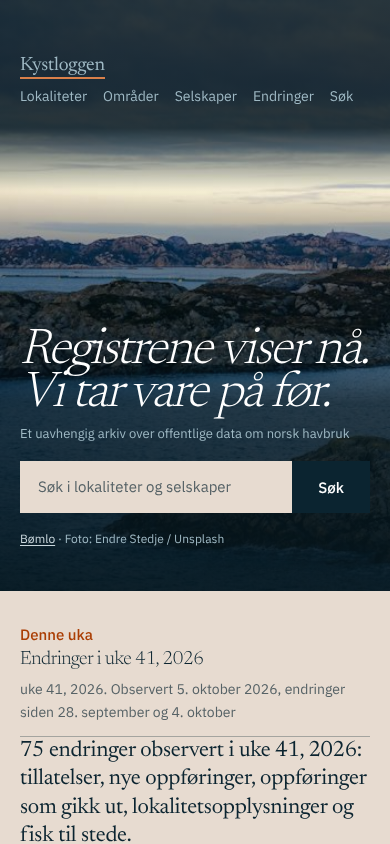 | 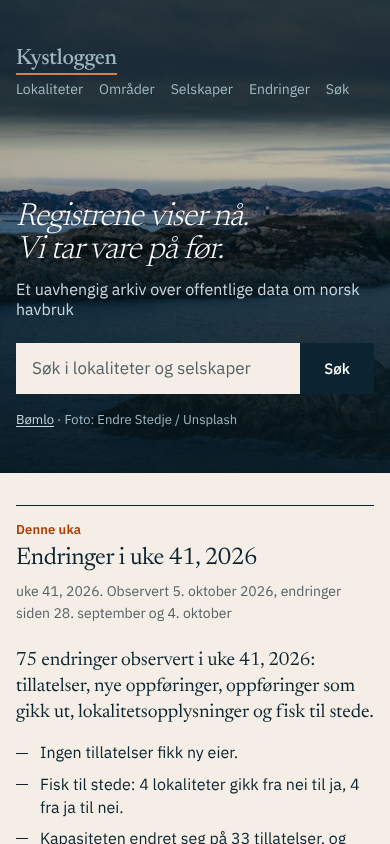 |

Utsnitt per seksjon, før: [Endringer i uke 41, 2026](for/forside-390-01-endringer-i-uke-41-2026.png) · [13 produksjonsområder](for/forside-390-02-13-produksjonsomrader.png) · [Få beskjed når noe endrer seg](for/forside-390-03-fa-beskjed-nar-noe-endrer-seg.png) · [Arkivet](for/forside-390-04-arkivet.png) · [Bunnteksten](for/forside-390-05-bunnteksten.png)

Utsnitt per seksjon, etter: [Endringer i uke 41, 2026](etter/forside-390-01-endringer-i-uke-41-2026.png) · [Arkivet](etter/forside-390-02-arkivet.png) · [13 produksjonsområder](etter/forside-390-03-13-produksjonsomrader.png) · [Få beskjed når noe endrer seg](etter/forside-390-04-fa-beskjed-nar-noe-endrer-seg.png) · [Bunnteksten](etter/forside-390-05-bunnteksten.png)

**1440 px** — før 3 764 px, etter 3 297 px

| Før | Etter |
|---|---|
| 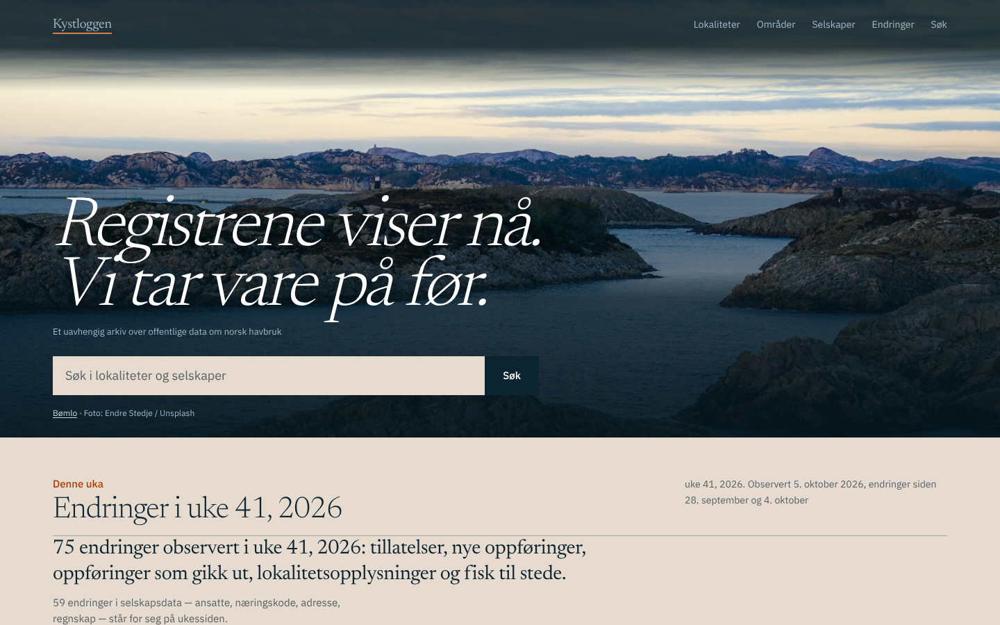 | 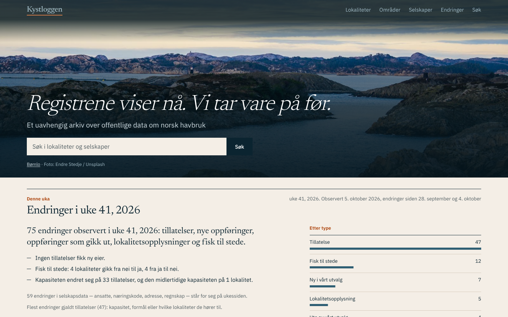 |

Utsnitt per seksjon, før: [Endringer i uke 41, 2026](for/forside-1440-01-endringer-i-uke-41-2026.png) · [13 produksjonsområder](for/forside-1440-02-13-produksjonsomrader.png) · [Få beskjed når noe endrer seg](for/forside-1440-03-fa-beskjed-nar-noe-endrer-seg.png) · [Arkivet](for/forside-1440-04-arkivet.png) · [Bunnteksten](for/forside-1440-05-bunnteksten.png)

Utsnitt per seksjon, etter: [Endringer i uke 41, 2026](etter/forside-1440-01-endringer-i-uke-41-2026.png) · [Arkivet](etter/forside-1440-02-arkivet.png) · [13 produksjonsområder](etter/forside-1440-03-13-produksjonsomrader.png) · [Få beskjed når noe endrer seg](etter/forside-1440-04-fa-beskjed-nar-noe-endrer-seg.png) · [Bunnteksten](etter/forside-1440-05-bunnteksten.png)

### Uke 41 — `/endringer/2026-41/`

**390 px** — før 28 077 px, etter 10 873 px

| Før | Etter |
|---|---|
| 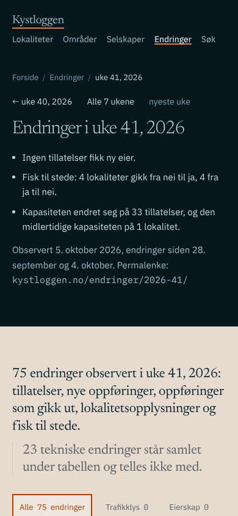 | 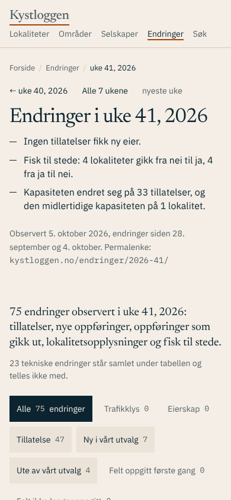 |

Utsnitt per seksjon, før: [Siter denne uka](for/uke-41-390-01-siter-denne-uka.png) · [Bunnteksten](for/uke-41-390-02-bunnteksten.png)

Utsnitt per seksjon, etter: [Last ned uka](etter/uke-41-390-01-last-ned-uka.png) · [Siter denne uka](etter/uke-41-390-02-siter-denne-uka.png) · [Bunnteksten](etter/uke-41-390-03-bunnteksten.png)

**1440 px** — før 5 987 px, etter 5 376 px

| Før | Etter |
|---|---|
| 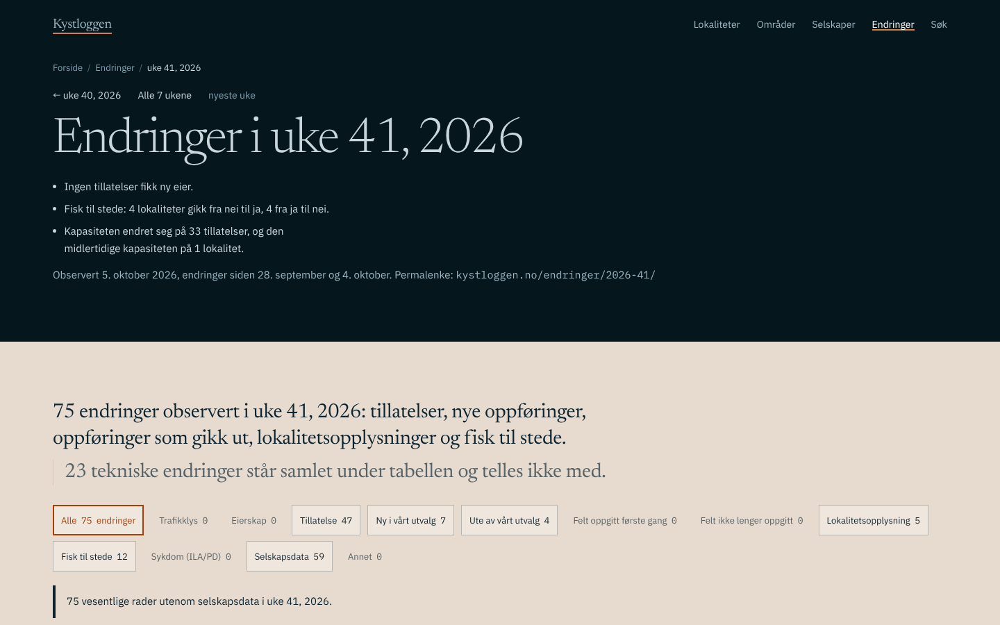 | 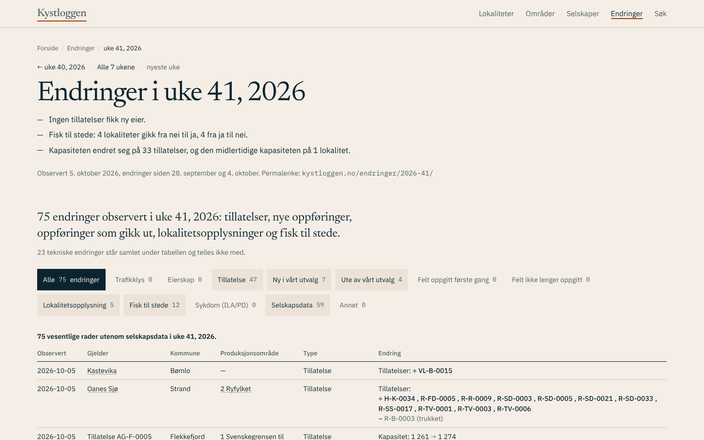 |

Utsnitt per seksjon, før: [Siter denne uka](for/uke-41-1440-01-siter-denne-uka.png) · [Bunnteksten](for/uke-41-1440-02-bunnteksten.png)

Utsnitt per seksjon, etter: [Last ned uka](etter/uke-41-1440-01-last-ned-uka.png) · [Siter denne uka](etter/uke-41-1440-02-siter-denne-uka.png) · [Bunnteksten](etter/uke-41-1440-03-bunnteksten.png)

### Lokalitet 45140 — `/lokalitet/45140/`

**390 px** — før 8 918 px, etter 7 337 px

| Før | Etter |
|---|---|
| 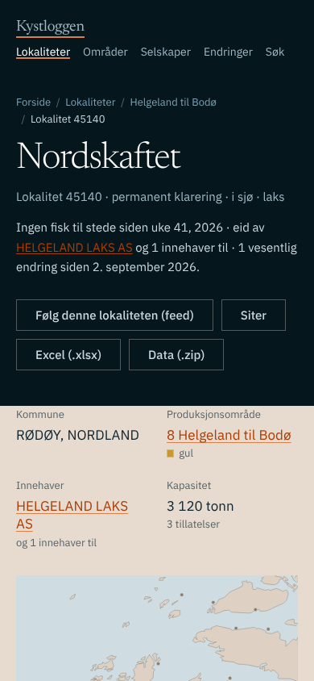 | 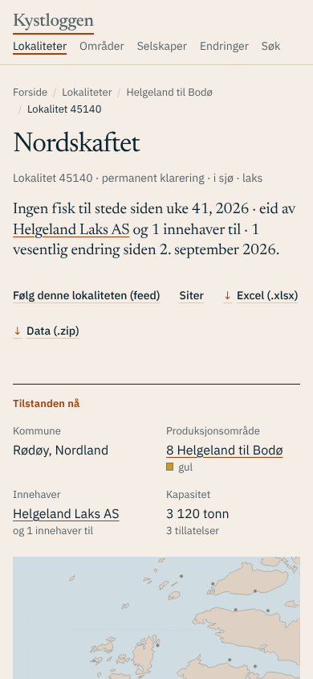 |

Utsnitt per seksjon, før: [Tilstanden nå](for/lokalitet-45140-390-01-tilstanden-na.png) · [Endringer vi har sett](for/lokalitet-45140-390-02-endringer-vi-har-sett.png) · [Fisk til stede](for/lokalitet-45140-390-03-fisk-til-stede.png) · [Siter denne siden](for/lokalitet-45140-390-04-siter-denne-siden.png) · [Lakselus, voksne hunnlus per fisk](for/lokalitet-45140-390-05-lakselus-voksne-hunnlus-per-fisk.png) · [Tillatelser](for/lokalitet-45140-390-06-tillatelser.png) · [Registerfeltene](for/lokalitet-45140-390-07-registerfeltene.png) · [Historikk kildene selv fører](for/lokalitet-45140-390-08-historikk-kildene-selv-forer.png) · [Bunnteksten](for/lokalitet-45140-390-09-bunnteksten.png)

Utsnitt per seksjon, etter: [Tilstanden nå](etter/lokalitet-45140-390-01-tilstanden-na.png) · [Endringer vi har sett](etter/lokalitet-45140-390-02-endringer-vi-har-sett.png) · [Fisk til stede](etter/lokalitet-45140-390-03-fisk-til-stede.png) · [Lakselus, voksne hunnlus per fisk](etter/lokalitet-45140-390-04-lakselus-voksne-hunnlus-per-fisk.png) · [Tillatelser](etter/lokalitet-45140-390-05-tillatelser.png) · [Registerfeltene](etter/lokalitet-45140-390-06-registerfeltene.png) · [Historikk kildene selv fører](etter/lokalitet-45140-390-07-historikk-kildene-selv-forer.png) · [Siter denne siden](etter/lokalitet-45140-390-08-siter-denne-siden.png) · [Bunnteksten](etter/lokalitet-45140-390-09-bunnteksten.png)

**1440 px** — før 4 769 px, etter 4 143 px

| Før | Etter |
|---|---|
| 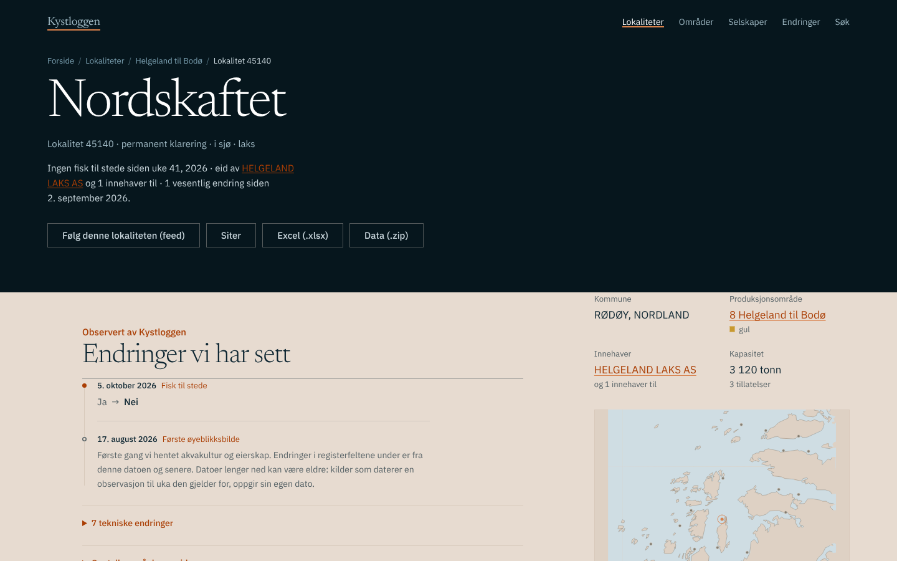 | 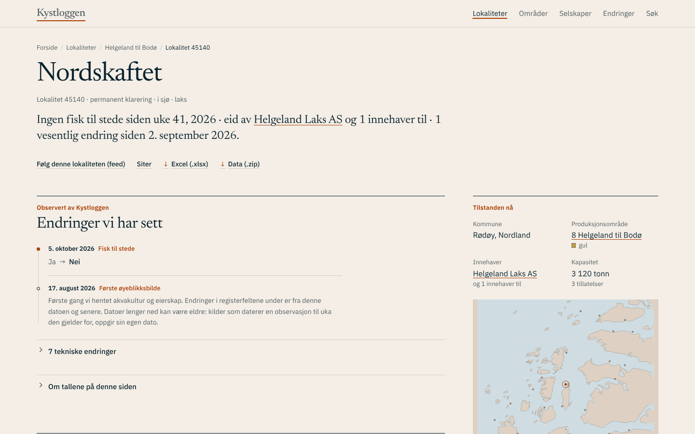 |

Utsnitt per seksjon, før: [Tilstanden nå](for/lokalitet-45140-1440-01-tilstanden-na.png) · [Endringer vi har sett](for/lokalitet-45140-1440-02-endringer-vi-har-sett.png) · [Fisk til stede](for/lokalitet-45140-1440-03-fisk-til-stede.png) · [Siter denne siden](for/lokalitet-45140-1440-04-siter-denne-siden.png) · [Lakselus, voksne hunnlus per fisk](for/lokalitet-45140-1440-05-lakselus-voksne-hunnlus-per-fisk.png) · [Tillatelser](for/lokalitet-45140-1440-06-tillatelser.png) · [Registerfeltene](for/lokalitet-45140-1440-07-registerfeltene.png) · [Historikk kildene selv fører](for/lokalitet-45140-1440-08-historikk-kildene-selv-forer.png) · [Bunnteksten](for/lokalitet-45140-1440-09-bunnteksten.png)

Utsnitt per seksjon, etter: [Tilstanden nå](etter/lokalitet-45140-1440-01-tilstanden-na.png) · [Endringer vi har sett](etter/lokalitet-45140-1440-02-endringer-vi-har-sett.png) · [Fisk til stede](etter/lokalitet-45140-1440-03-fisk-til-stede.png) · [Lakselus, voksne hunnlus per fisk](etter/lokalitet-45140-1440-04-lakselus-voksne-hunnlus-per-fisk.png) · [Tillatelser](etter/lokalitet-45140-1440-05-tillatelser.png) · [Registerfeltene](etter/lokalitet-45140-1440-06-registerfeltene.png) · [Historikk kildene selv fører](etter/lokalitet-45140-1440-07-historikk-kildene-selv-forer.png) · [Siter denne siden](etter/lokalitet-45140-1440-08-siter-denne-siden.png) · [Bunnteksten](etter/lokalitet-45140-1440-09-bunnteksten.png)

### Lokalitet 12325 — `/lokalitet/12325/`

**390 px** — før 5 747 px, etter 5 016 px

| Før | Etter |
|---|---|
| 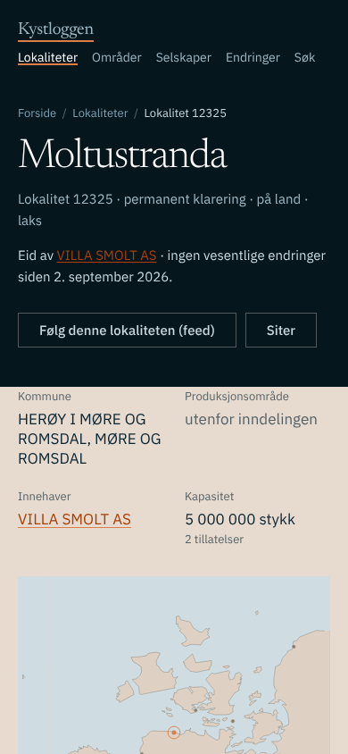 | 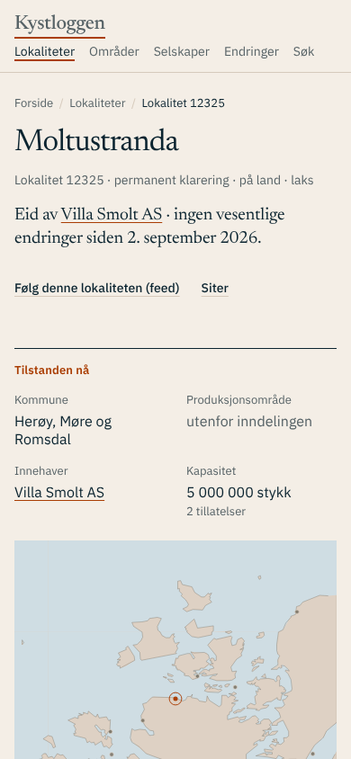 |

Utsnitt per seksjon, før: [Tilstanden nå](for/lokalitet-12325-390-01-tilstanden-na.png) · [Endringer vi har sett](for/lokalitet-12325-390-02-endringer-vi-har-sett.png) · [Fisk til stede](for/lokalitet-12325-390-03-fisk-til-stede.png) · [Siter denne siden](for/lokalitet-12325-390-04-siter-denne-siden.png) · [Lakselus, voksne hunnlus per fisk](for/lokalitet-12325-390-05-lakselus-voksne-hunnlus-per-fisk.png) · [Tillatelser](for/lokalitet-12325-390-06-tillatelser.png) · [Registerfeltene](for/lokalitet-12325-390-07-registerfeltene.png) · [Historikk kildene selv fører](for/lokalitet-12325-390-08-historikk-kildene-selv-forer.png) · [Bunnteksten](for/lokalitet-12325-390-09-bunnteksten.png)

Utsnitt per seksjon, etter: [Tilstanden nå](etter/lokalitet-12325-390-01-tilstanden-na.png) · [Endringer vi har sett](etter/lokalitet-12325-390-02-endringer-vi-har-sett.png) · [Fisk til stede](etter/lokalitet-12325-390-03-fisk-til-stede.png) · [Lakselus, voksne hunnlus per fisk](etter/lokalitet-12325-390-04-lakselus-voksne-hunnlus-per-fisk.png) · [Tillatelser](etter/lokalitet-12325-390-05-tillatelser.png) · [Registerfeltene](etter/lokalitet-12325-390-06-registerfeltene.png) · [Historikk kildene selv fører](etter/lokalitet-12325-390-07-historikk-kildene-selv-forer.png) · [Siter denne siden](etter/lokalitet-12325-390-08-siter-denne-siden.png) · [Bunnteksten](etter/lokalitet-12325-390-09-bunnteksten.png)

**1440 px** — før 3 674 px, etter 3 073 px

| Før | Etter |
|---|---|
| 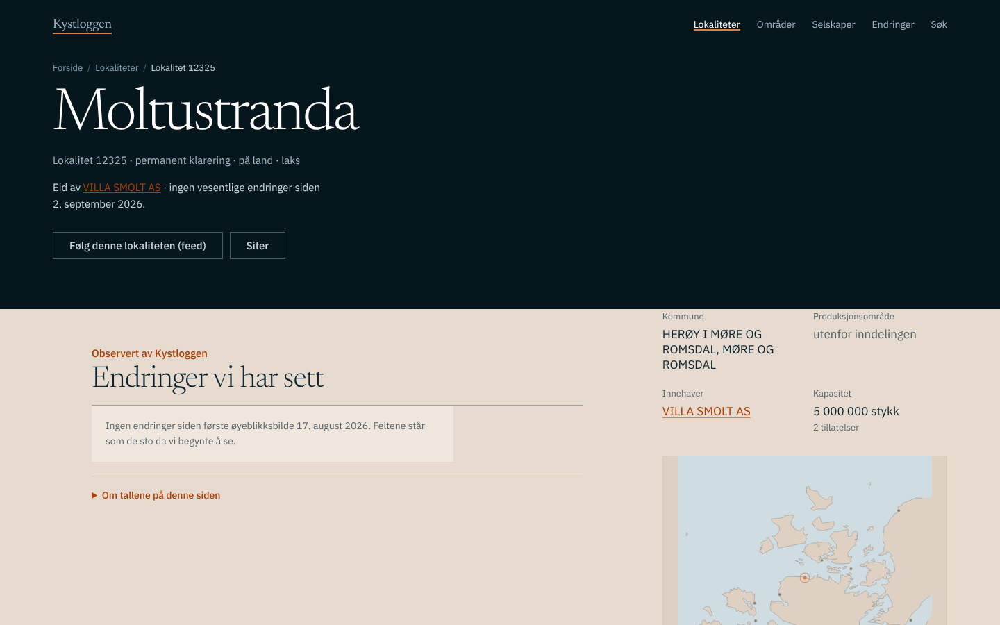 | 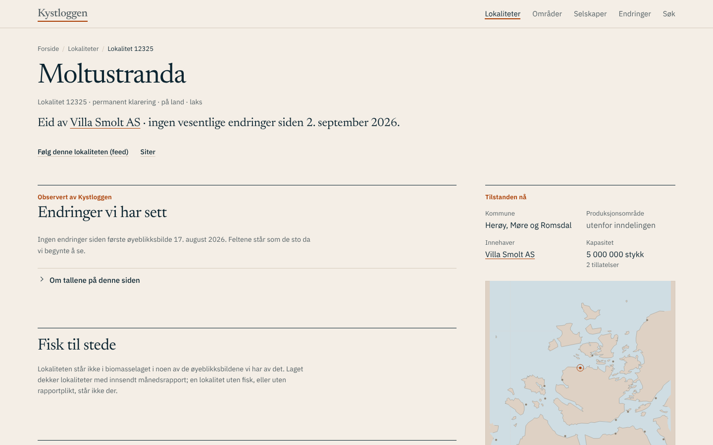 |

Utsnitt per seksjon, før: [Tilstanden nå](for/lokalitet-12325-1440-01-tilstanden-na.png) · [Endringer vi har sett](for/lokalitet-12325-1440-02-endringer-vi-har-sett.png) · [Fisk til stede](for/lokalitet-12325-1440-03-fisk-til-stede.png) · [Siter denne siden](for/lokalitet-12325-1440-04-siter-denne-siden.png) · [Lakselus, voksne hunnlus per fisk](for/lokalitet-12325-1440-05-lakselus-voksne-hunnlus-per-fisk.png) · [Tillatelser](for/lokalitet-12325-1440-06-tillatelser.png) · [Registerfeltene](for/lokalitet-12325-1440-07-registerfeltene.png) · [Historikk kildene selv fører](for/lokalitet-12325-1440-08-historikk-kildene-selv-forer.png) · [Bunnteksten](for/lokalitet-12325-1440-09-bunnteksten.png)

Utsnitt per seksjon, etter: [Tilstanden nå](etter/lokalitet-12325-1440-01-tilstanden-na.png) · [Endringer vi har sett](etter/lokalitet-12325-1440-02-endringer-vi-har-sett.png) · [Fisk til stede](etter/lokalitet-12325-1440-03-fisk-til-stede.png) · [Lakselus, voksne hunnlus per fisk](etter/lokalitet-12325-1440-04-lakselus-voksne-hunnlus-per-fisk.png) · [Tillatelser](etter/lokalitet-12325-1440-05-tillatelser.png) · [Registerfeltene](etter/lokalitet-12325-1440-06-registerfeltene.png) · [Historikk kildene selv fører](etter/lokalitet-12325-1440-07-historikk-kildene-selv-forer.png) · [Siter denne siden](etter/lokalitet-12325-1440-08-siter-denne-siden.png) · [Bunnteksten](etter/lokalitet-12325-1440-09-bunnteksten.png)

### Selskap 921668236 — `/selskap/921668236/`

**390 px** — før 4 284 px, etter 4 061 px

| Før | Etter |
|---|---|
| 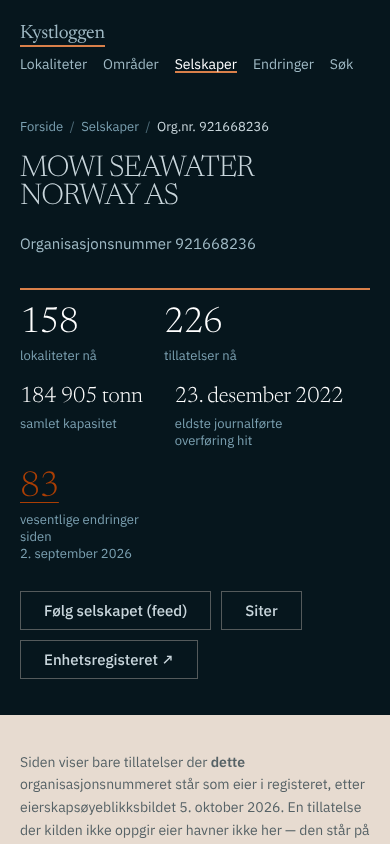 | 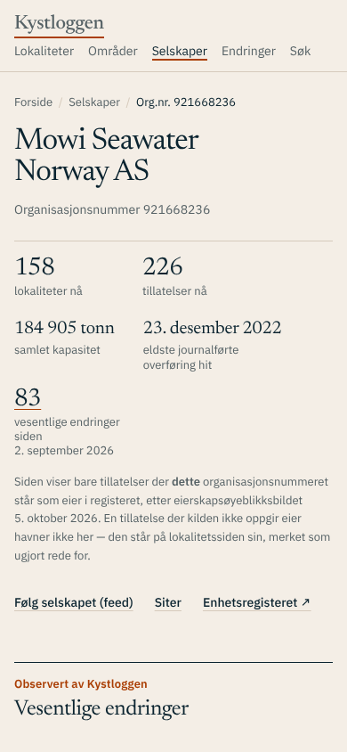 |

Utsnitt per seksjon, før: [Vesentlige endringer](for/selskap-921668236-390-01-vesentlige-endringer.png) · [Lokaliteter](for/selskap-921668236-390-02-lokaliteter.png) · [Tillatelser](for/selskap-921668236-390-03-tillatelser.png) · [Eierskap over tid](for/selskap-921668236-390-04-eierskap-over-tid.png) · [Hva Enhetsregisteret sier](for/selskap-921668236-390-05-hva-enhetsregisteret-sier.png) · [Hva denne siden ikke sier](for/selskap-921668236-390-06-hva-denne-siden-ikke-sier.png) · [Siter denne siden](for/selskap-921668236-390-07-siter-denne-siden.png) · [Bunnteksten](for/selskap-921668236-390-08-bunnteksten.png)

Utsnitt per seksjon, etter: [Vesentlige endringer](etter/selskap-921668236-390-01-vesentlige-endringer.png) · [Lokaliteter](etter/selskap-921668236-390-02-lokaliteter.png) · [Tillatelser](etter/selskap-921668236-390-03-tillatelser.png) · [Eierskap over tid](etter/selskap-921668236-390-04-eierskap-over-tid.png) · [Hva Enhetsregisteret sier](etter/selskap-921668236-390-05-hva-enhetsregisteret-sier.png) · [Hva denne siden ikke sier](etter/selskap-921668236-390-06-hva-denne-siden-ikke-sier.png) · [Siter denne siden](etter/selskap-921668236-390-07-siter-denne-siden.png) · [Bunnteksten](etter/selskap-921668236-390-08-bunnteksten.png)

**1440 px** — før 3 427 px, etter 2 909 px

| Før | Etter |
|---|---|
| 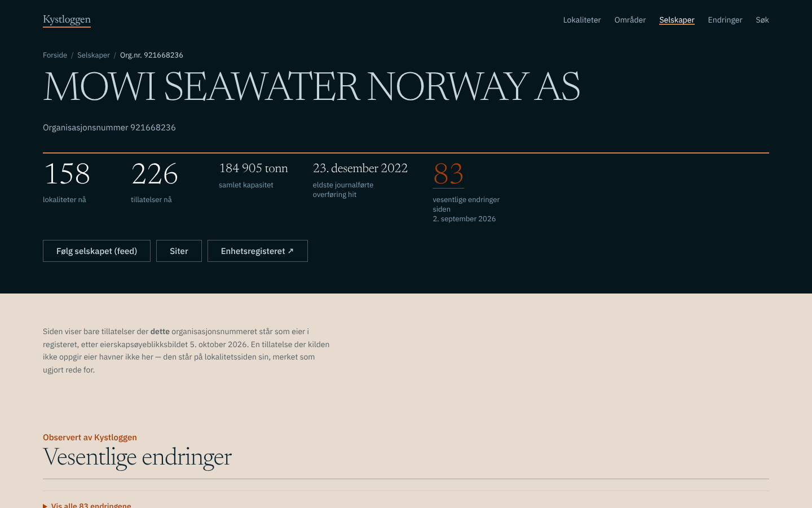 | 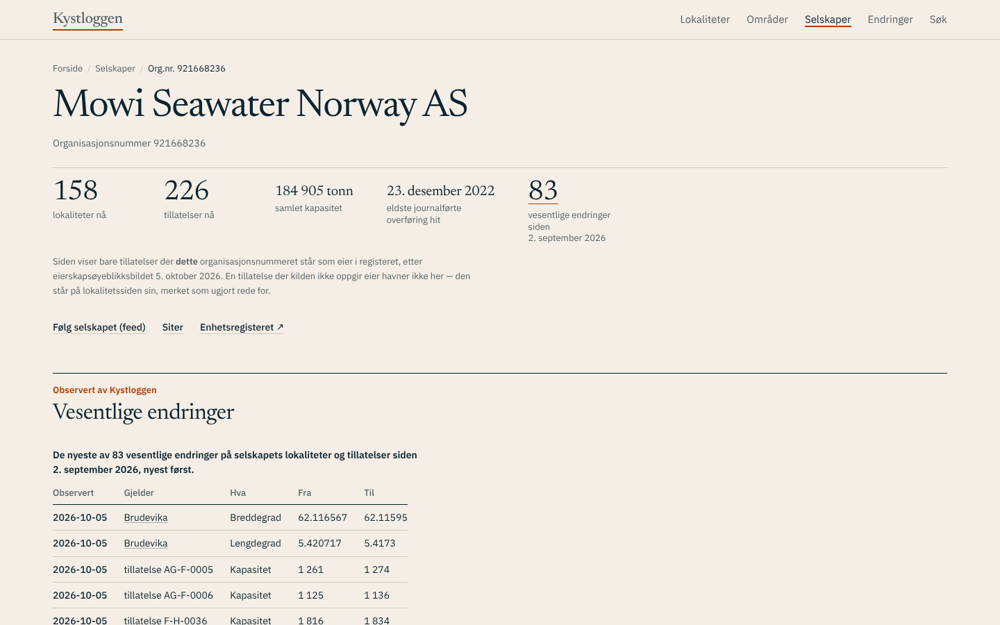 |

Utsnitt per seksjon, før: [Vesentlige endringer](for/selskap-921668236-1440-01-vesentlige-endringer.png) · [Lokaliteter](for/selskap-921668236-1440-02-lokaliteter.png) · [Tillatelser](for/selskap-921668236-1440-03-tillatelser.png) · [Eierskap over tid](for/selskap-921668236-1440-04-eierskap-over-tid.png) · [Hva Enhetsregisteret sier](for/selskap-921668236-1440-05-hva-enhetsregisteret-sier.png) · [Hva denne siden ikke sier](for/selskap-921668236-1440-06-hva-denne-siden-ikke-sier.png) · [Siter denne siden](for/selskap-921668236-1440-07-siter-denne-siden.png) · [Bunnteksten](for/selskap-921668236-1440-08-bunnteksten.png)

Utsnitt per seksjon, etter: [Vesentlige endringer](etter/selskap-921668236-1440-01-vesentlige-endringer.png) · [Lokaliteter](etter/selskap-921668236-1440-02-lokaliteter.png) · [Tillatelser](etter/selskap-921668236-1440-03-tillatelser.png) · [Eierskap over tid](etter/selskap-921668236-1440-04-eierskap-over-tid.png) · [Hva Enhetsregisteret sier](etter/selskap-921668236-1440-05-hva-enhetsregisteret-sier.png) · [Hva denne siden ikke sier](etter/selskap-921668236-1440-06-hva-denne-siden-ikke-sier.png) · [Siter denne siden](etter/selskap-921668236-1440-07-siter-denne-siden.png) · [Bunnteksten](etter/selskap-921668236-1440-08-bunnteksten.png)

### Område 4 — `/produksjonsomrade/4/`

**390 px** — før 59 939 px, etter 17 323 px

| Før | Etter |
|---|---|
| 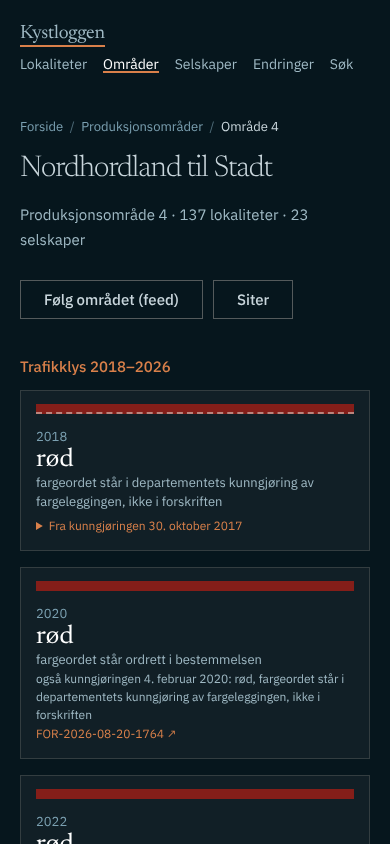 | 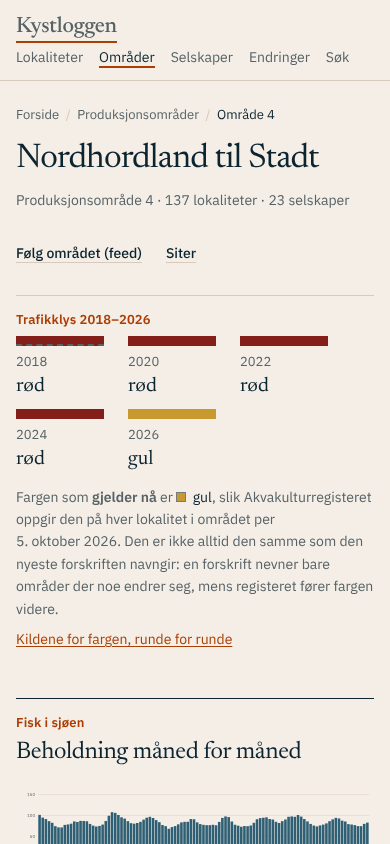 |

Utsnitt per seksjon, før: [Beholdning måned for måned](for/omrade-4-390-01-beholdning-maned-for-maned.png) · [Kart over området](for/omrade-4-390-02-kart-over-omradet.png) · [137 lokaliteter](for/omrade-4-390-03-137-lokaliteter.png) · [Endringer](for/omrade-4-390-04-endringer.png) · [Hvor sterkt fargen er belagt](for/omrade-4-390-05-hvor-sterkt-fargen-er-belagt.png) · [Hva denne siden ikke sier](for/omrade-4-390-06-hva-denne-siden-ikke-sier.png) · [Siter denne siden](for/omrade-4-390-07-siter-denne-siden.png) · [Bunnteksten](for/omrade-4-390-08-bunnteksten.png)

Utsnitt per seksjon, etter: [Beholdning måned for måned](etter/omrade-4-390-01-beholdning-maned-for-maned.png) · [Kart over området](etter/omrade-4-390-02-kart-over-omradet.png) · [137 lokaliteter](etter/omrade-4-390-03-137-lokaliteter.png) · [Endringer](etter/omrade-4-390-04-endringer.png) · [Kildene for fargen](etter/omrade-4-390-05-kildene-for-fargen.png) · [Hva denne siden ikke sier](etter/omrade-4-390-06-hva-denne-siden-ikke-sier.png) · [Siter denne siden](etter/omrade-4-390-07-siter-denne-siden.png) · [Bunnteksten](etter/omrade-4-390-08-bunnteksten.png)

**1440 px** — før 15 160 px, etter 12 806 px

| Før | Etter |
|---|---|
| 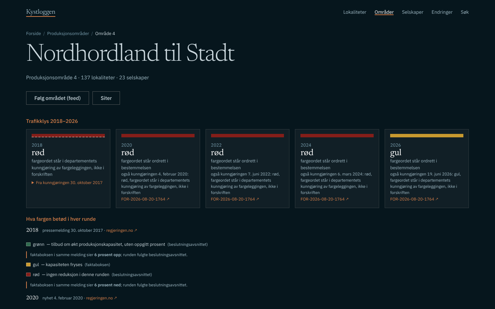 | 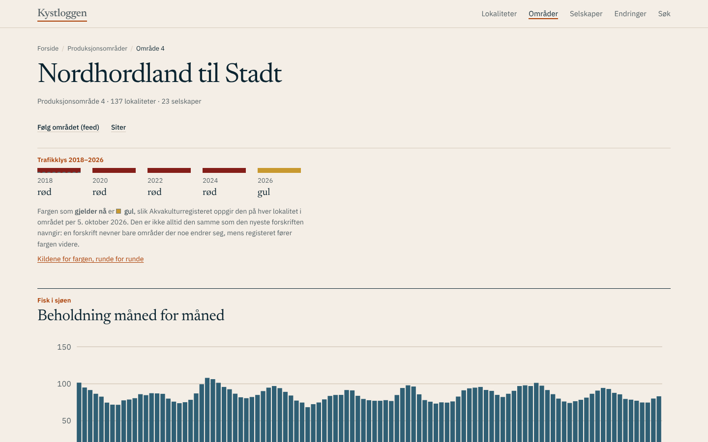 |

Utsnitt per seksjon, før: [Beholdning måned for måned](for/omrade-4-1440-01-beholdning-maned-for-maned.png) · [Kart over området](for/omrade-4-1440-02-kart-over-omradet.png) · [137 lokaliteter](for/omrade-4-1440-03-137-lokaliteter.png) · [Endringer](for/omrade-4-1440-04-endringer.png) · [Hvor sterkt fargen er belagt](for/omrade-4-1440-05-hvor-sterkt-fargen-er-belagt.png) · [Hva denne siden ikke sier](for/omrade-4-1440-06-hva-denne-siden-ikke-sier.png) · [Siter denne siden](for/omrade-4-1440-07-siter-denne-siden.png) · [Bunnteksten](for/omrade-4-1440-08-bunnteksten.png)

Utsnitt per seksjon, etter: [Beholdning måned for måned](etter/omrade-4-1440-01-beholdning-maned-for-maned.png) · [Kart over området](etter/omrade-4-1440-02-kart-over-omradet.png) · [137 lokaliteter](etter/omrade-4-1440-03-137-lokaliteter.png) · [Endringer](etter/omrade-4-1440-04-endringer.png) · [Kildene for fargen](etter/omrade-4-1440-05-kildene-for-fargen.png) · [Hva denne siden ikke sier](etter/omrade-4-1440-06-hva-denne-siden-ikke-sier.png) · [Siter denne siden](etter/omrade-4-1440-07-siter-denne-siden.png) · [Bunnteksten](etter/omrade-4-1440-08-bunnteksten.png)

### Lokalitetsindeksen — `/lokalitet/`

**390 px** — før 6 974 px, etter 6 475 px

| Før | Etter |
|---|---|
| 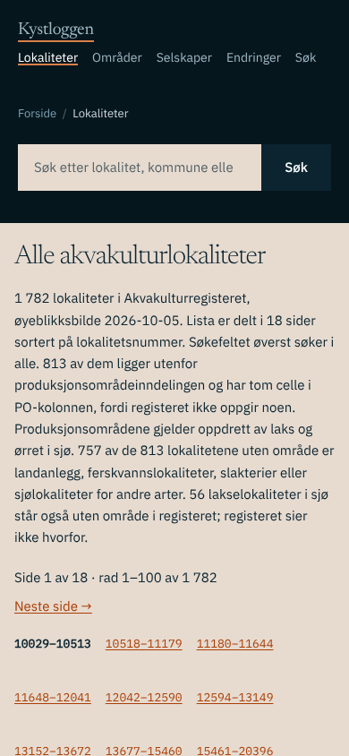 | 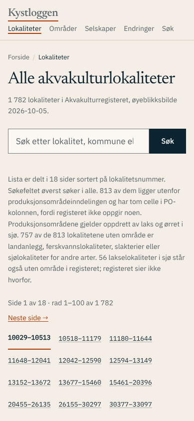 |

Utsnitt per seksjon, før: [Lokaliteter uten koordinater](for/lokalitetsindeks-390-01-lokaliteter-uten-koordinater.png) · [Bunnteksten](for/lokalitetsindeks-390-02-bunnteksten.png)

Utsnitt per seksjon, etter: [Lokaliteter uten koordinater](etter/lokalitetsindeks-390-01-lokaliteter-uten-koordinater.png) · [Bunnteksten](etter/lokalitetsindeks-390-02-bunnteksten.png)

**1440 px** — før 6 598 px, etter 5 526 px

| Før | Etter |
|---|---|
| 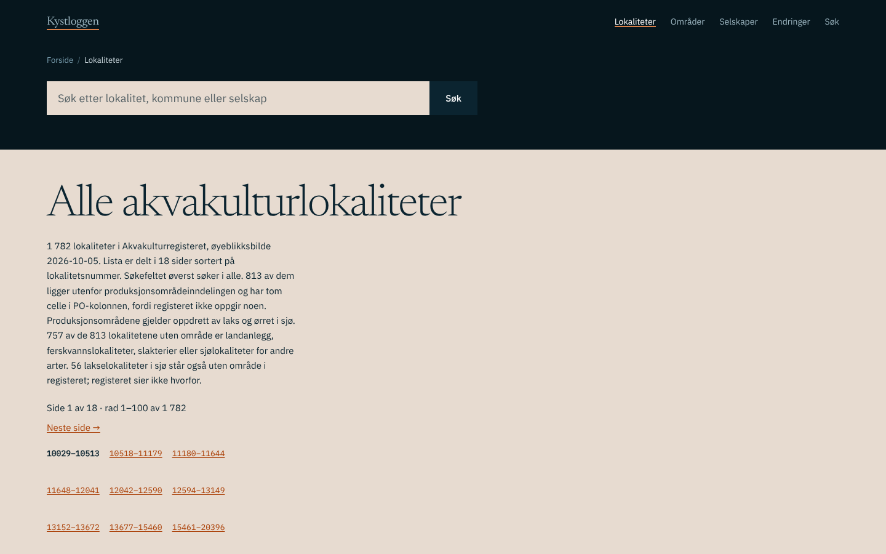 | 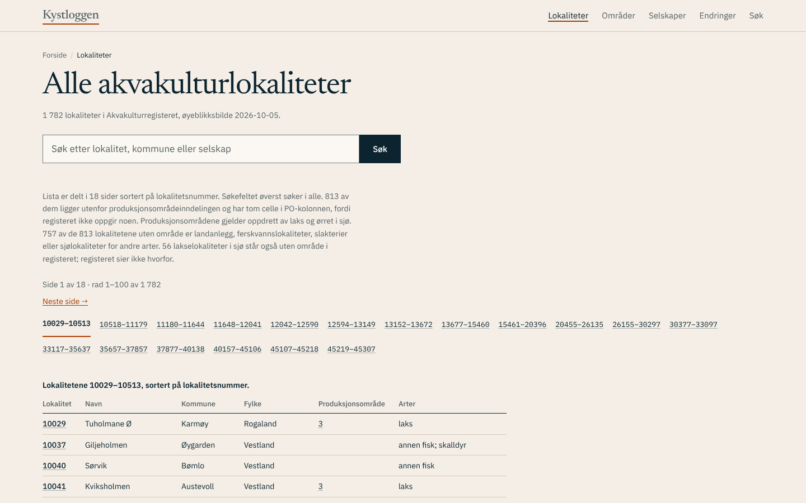 |

Utsnitt per seksjon, før: [Lokaliteter uten koordinater](for/lokalitetsindeks-1440-01-lokaliteter-uten-koordinater.png) · [Bunnteksten](for/lokalitetsindeks-1440-02-bunnteksten.png)

Utsnitt per seksjon, etter: [Lokaliteter uten koordinater](etter/lokalitetsindeks-1440-01-lokaliteter-uten-koordinater.png) · [Bunnteksten](etter/lokalitetsindeks-1440-02-bunnteksten.png)

### Om — `/om/`

**390 px** — før 12 448 px, etter 9 777 px

| Før | Etter |
|---|---|
| 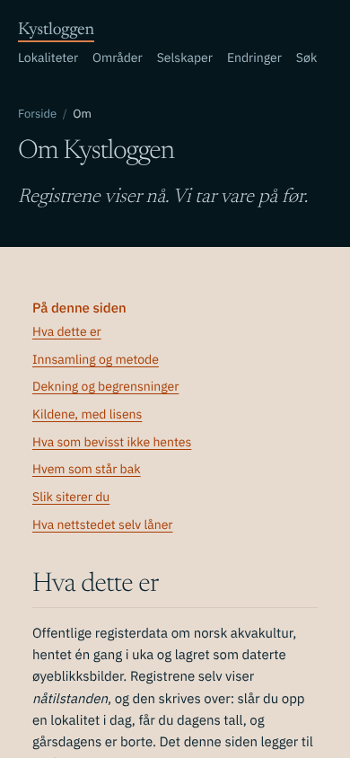 | 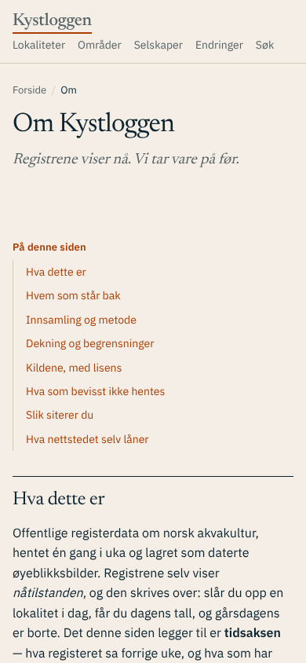 |

Utsnitt per seksjon, før: [Hva dette er](for/om-390-01-hva-dette-er.png) · [Hvordan det samles inn, og hvor ofte](for/om-390-02-hvordan-det-samles-inn-og-hvor-ofte.png) · [Hva dekningen er](for/om-390-03-hva-dekningen-er.png) · [Kildene, med lisens og attribusjon](for/om-390-04-kildene-med-lisens-og-attribusjon.png) · [Hva som bevisst ikke hentes](for/om-390-05-hva-som-bevisst-ikke-hentes.png) · [Hvem som står bak](for/om-390-06-hvem-som-star-bak.png) · [Sitering](for/om-390-07-sitering.png) · [Hva nettstedet selv låner](for/om-390-08-hva-nettstedet-selv-laner.png) · [Bunnteksten](for/om-390-09-bunnteksten.png)

Utsnitt per seksjon, etter: [Hva dette er](etter/om-390-01-hva-dette-er.png) · [Hvem som står bak](etter/om-390-02-hvem-som-star-bak.png) · [Hvordan det samles inn, og hvor ofte](etter/om-390-03-hvordan-det-samles-inn-og-hvor-ofte.png) · [Hva dekningen er](etter/om-390-04-hva-dekningen-er.png) · [Kildene, med lisens og attribusjon](etter/om-390-05-kildene-med-lisens-og-attribusjon.png) · [Hva som bevisst ikke hentes](etter/om-390-06-hva-som-bevisst-ikke-hentes.png) · [Sitering](etter/om-390-07-sitering.png) · [Hva nettstedet selv låner](etter/om-390-08-hva-nettstedet-selv-laner.png) · [Bunnteksten](etter/om-390-09-bunnteksten.png)

**1440 px** — før 6 214 px, etter 5 445 px

| Før | Etter |
|---|---|
| 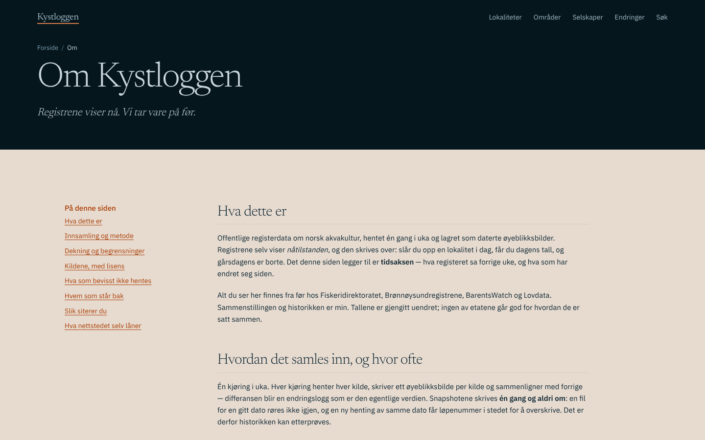 | 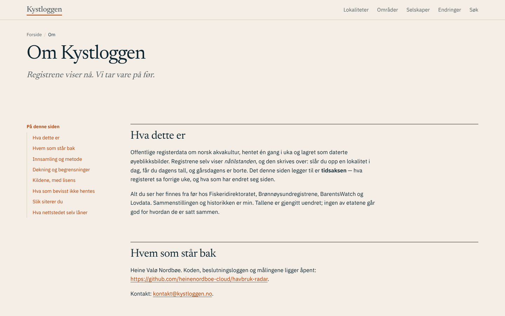 |

Utsnitt per seksjon, før: [Hva dette er](for/om-1440-01-hva-dette-er.png) · [Hvordan det samles inn, og hvor ofte](for/om-1440-02-hvordan-det-samles-inn-og-hvor-ofte.png) · [Hva dekningen er](for/om-1440-03-hva-dekningen-er.png) · [Kildene, med lisens og attribusjon](for/om-1440-04-kildene-med-lisens-og-attribusjon.png) · [Hva som bevisst ikke hentes](for/om-1440-05-hva-som-bevisst-ikke-hentes.png) · [Hvem som står bak](for/om-1440-06-hvem-som-star-bak.png) · [Sitering](for/om-1440-07-sitering.png) · [Hva nettstedet selv låner](for/om-1440-08-hva-nettstedet-selv-laner.png) · [Bunnteksten](for/om-1440-09-bunnteksten.png)

Utsnitt per seksjon, etter: [Hva dette er](etter/om-1440-01-hva-dette-er.png) · [Hvem som står bak](etter/om-1440-02-hvem-som-star-bak.png) · [Hvordan det samles inn, og hvor ofte](etter/om-1440-03-hvordan-det-samles-inn-og-hvor-ofte.png) · [Hva dekningen er](etter/om-1440-04-hva-dekningen-er.png) · [Kildene, med lisens og attribusjon](etter/om-1440-05-kildene-med-lisens-og-attribusjon.png) · [Hva som bevisst ikke hentes](etter/om-1440-06-hva-som-bevisst-ikke-hentes.png) · [Sitering](etter/om-1440-07-sitering.png) · [Hva nettstedet selv låner](etter/om-1440-08-hva-nettstedet-selv-laner.png) · [Bunnteksten](etter/om-1440-09-bunnteksten.png)

